### Analyzing Information Technology Sentiment Through Twitter Data

#### Project Description
This project was completed for my Data Science Practicum I course. In this project I have attempted to combine my fascination with Twitter Data, my interest in Information Technology, and my interest in Data Engineering and Data Science. I have purposely put Data Engineering before Data Science as I first built an IT platform for me to work on and then used that platform to conduct aspects of Data Science to explore Information Technology through Twitter data.

#### Project Outcome
The intended outcome of this project is twofold:
1. Explore topics centered around Information Technology
2. Visualize Sentiment around Information Technology

#### IT Platform
My intent for this project was to run PySpark on Hadoop. For a previous project I ran a cluster of 3 virtual linux machines using my Windows laptop as the host machine. I found that this setup barely got me through the class. This time I decided to purchase, at auction, a dual core, 1TB hard drive, 16GB machine. On this machine I setup the following:

1. Ubuntu Host OS
2. Four Ubuntu Virtual Machines
3. Virtual machine 1 was used to collect tweets
4. Virtual machines 2 through 4 were setup as a hadoop cluster
5. VirtualBox, Ambari-Vagrant, Anaconda were used to setup the environment
6. The environment consists of PySpark running on a 3 node cluster, using Jupiter Notebooks

#### The Dataset
My dataset consists of tweets containing the following terms:
1. data
2. java
3. machine learning
4. iot
5. computer
6. computer programmer
7. database administrator
8. network engineer
9. network administrator
10. data scientist
11. systems
12. systems engineer
13. data analyst
14. technology
15. data architect
16. etl
17. etl architect
18. web programmer
19. automation engineer
20. data processing
21. devops
22. cloud
23. application engineer
24. software engineer
25. software developer
26. developer
27. information architect
28. programmer
29. security analyst
30. business intelligence
31. enterprise architect
32. solution architect
33. data warehouse
34. ai
35. robotics
36. information technology

My Tweets consisted of the following fields:

1. timetext
2. tweet_id
3. tweet_source
4. tweet_truncated
5. tweet_text
6. tweet_user_screen_name
7. tweet_user_id
8. tweet_user_location
9. tweet_user_description
10. tweet_user_followers_count
11. tweet_user_statuses_count
12. tweet_user_time_zone
13. tweet_user_geo_enabled
14. tweet_user_lang
15. tweet_coordinates_coordinates
16. tweet_place_country
17. tweet_place_country_code
18. tweet_place_full_name
19. tweet_place_name
20. tweet_place_type

For this project I really only needed the tweet_text but I wanted to bring back as much information that I could should I want to do time based analysis or utilize the geo fields to perhaps break down sentiment by location.

#### Data Samples
###### Pre Clean File Listing
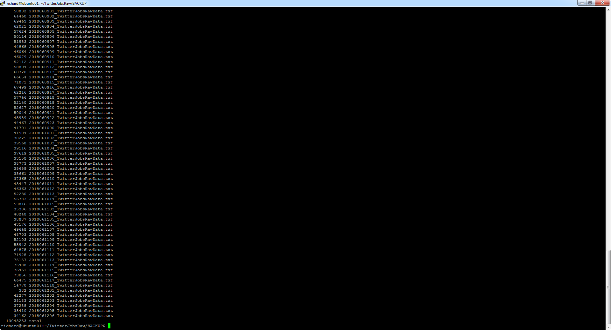

###### Pre Clean File Sample
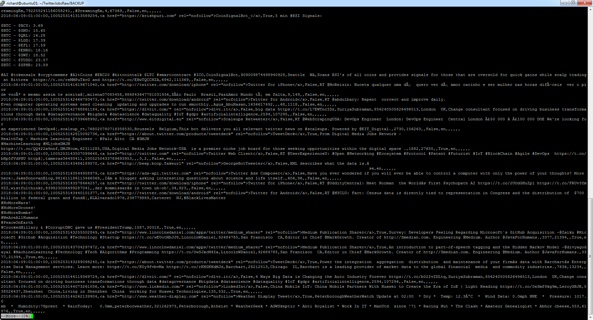

###### Post Clean File Listing
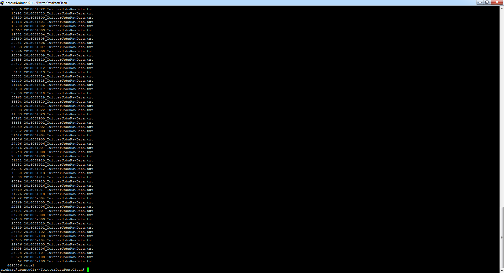

###### Post Clean File Sample
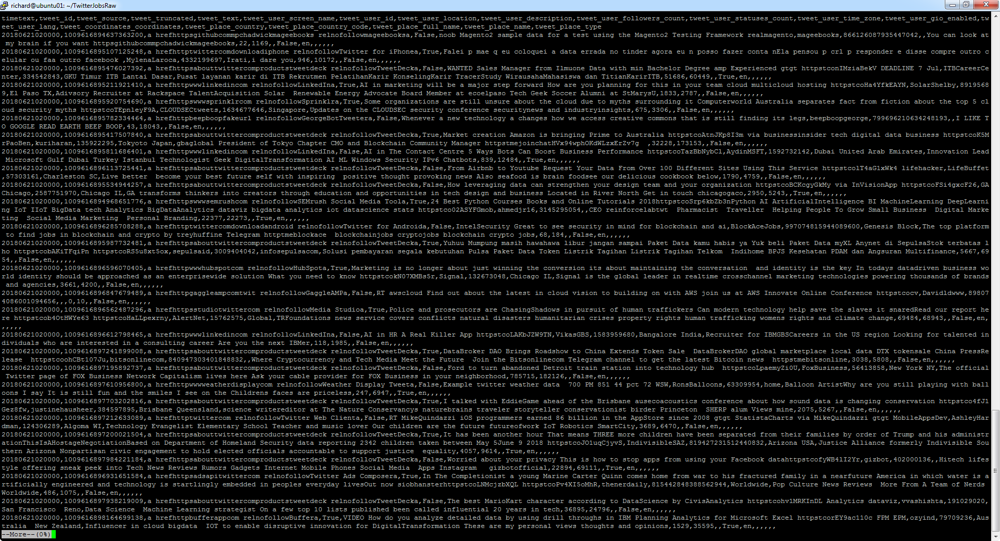

#### Data Cleaning
Initially the only data cleaning I did was to within each field remove commas and newlines. I did this thinking that with free form fields users could add commas and newlines. Little did I know that this was just the beginning. Thinking back, I really should have known that more data cleaning up front would have been needed.

*tweet_text = tweet_text.replace(',',' ').replace('\n', ' ')*

In addition, I only pulled back english tweets or so I thought.

*isnull(tweet["user"]["lang"]) == "en"*

After pulling back approximately 13 million tweets I realized further cleaning would be needed. The first thing I did was update my original Python script with addition cleaning and then I created another script to clean the data I had already retrieved. I adjusted the original script to only include letters, numbers, and spaces. In addition, I am expecting 20 fields. I also added a line of code to only include records that had 20 fields:

*tweet_text = re.sub('[^ a-zA-Z0-9]', '', tweet_text)*

*if tweet_line_len == 20:
     twitter_jobs_raw_data_file.write(tweet_line + '\n')*

The second script simply read the previously accumulated files, applied the above cleaning, and wrote the cleaned files back out to a different directory.

The last bit of data cleaning needed was discovered further into the project. The topic modeler used, LDA, would only model single word topics. I had both single and multiple word search terms. I wanted to make sure that my multiple word search terms would be candidates for topics. In order to accomplish this I wrote a third script that read all previously cleaned data and added an underscore to all of my multiple word search terms:

*machine learning became machine_learning*

#### Import Needed Libraries
The following libraries were used to build a Spark Context on my Hadoop Cluster, import the tweet data, topic model the tweet data, conduct sentiment analysis on the tweet data, and visualize that sentiment analysis:

1. import findspark
2. import string
3. import re as re
4. import nltk
5. import time
6. from pyspark.sql import SQLContext
7. from pyspark.sql.types import *
8. from pyspark.sql.functions import monotonically_increasing_id
9. from pyspark.mllib.util import MLUtils
10. from pyspark.ml.feature import RegexTokenizer, Tokenizer, StopWordsRemover, CountVectorizer, CountVectorizerModel, StopWordsRemover
11. from pyspark.mllib.clustering import LDA, LDAModel
12. from nltk.corpus import stopwords
13. from pyspark.mllib.linalg import Vector as oldVector, Vectors as oldVectors
14. from pyspark.ml.linalg import Vector as newVector, Vectors as newVectors
15. from pyspark.ml.feature import IDF
16. import numpy as np
17. import matplotlib.pyplot as plt
18. import pyspark.sql.functions as func

#### Create an SQL Context
This will be used for sql like distriburted data processing. As I get more familiar with what technology to use where I will be switching between using pyspard RDDs, pyspark dataframes, and pandas dataframes

sqlContext = SQLContext(sc)

#### Hadoop is the filesystem being used
This is a three node virtual cluster. Read in data from Hadoop

ITData = sc.textFile("hdfs:////user/vagrant/practicum/input")

#### Partitioning
By default, data is partitioned based on the data size. While I have over 8 million cleaned records collected. I have limited the number of records to approximately 100,000. I have had issues with my hadoop cluster processing through the data. I will need to gain a better understanding of the sizing needs as it relates to data size. 100,000 records produces 6 partitions.

#### Check the number of partitions created

ITData.getNumPartitions()

#### Additional data Cleaning
Further clean tweets, split them out into individual words, and number them by adding an index.

tokens = tweet.map(lambda document: document.strip().lower()) \
              .map(lambda document: re.split(" ", document)) \
              .map(lambda word: [x for x in word if x.isalpha()]) \
              .map(lambda word: [x for x in word if len(x) > 3]) \
              .map(lambda word: [x for x in word if x not in StopWords]) \
              .zipWithIndex()

#### Prepare for Topic Modeling    
cv = CountVectorizer(inputCol="tweet_words", outputCol="raw_features", vocabSize=5000, minDF=10.0)
cvmodel = cv.fit(tweet_df)
result_cv = cvmodel.transform(tweet_df)       
idf = IDF(inputCol="raw_features", outputCol="features")
idfModel = idf.fit(result_cv)
result_tfidf = idfModel.transform(result_cv)

#### Run Topic Modeler
num_topics = 10
max_iterations = 20
lda_model = LDA.train(rs_df['index', 'raw_features'].rdd.map(list), k=num_topics, maxIterations=max_iterations)

#### Display topics
for topic in range(len(topics_final)):
    print("Topic" + str(topic) + ":")
    for term in topics_final[topic]:
        print(term)
    print('\n')

#### Set search terms
The above above relates topics to the terms I searched in Twitter.  
For sentiment analysis, I would like to rate the actual search terms. For this I will build a python array with those search terms

search_terms = ["machine_learning", "computer_programmer", "database_engineer", "network_engineer", \
"data_scientist", "systems_engineer", "data_analyst", "data_architect", "etl_architect", \
"web_programmer", "automation_engineer", "data_processing", "application_engineer", \
"software_engineer", "software_developer", "information_architect", "security_analyst", \
"business_intelligence", "enterprise_architect", "solution_architect", "data_warehouse", \
"information_technology", "data", "java", "iot", "computer", "systems", "technology", \
"etl", "devops", "cloud", "developer", "programmer", "ai"]    

#### Relate the search term to the tweet
This will relate the search term to the tweet so later I can relate the sentiment of the tweet to the search term.

def SearchTopics(topics, tweet_text):
    for term in topics:
        result = tweet_text.find(term)
        if result > -1:
            return term, tweet_text
    return 'NA', tweet_text

While removing stopwords helps obtain valid topics it will not help with sentiment analysis. With topics in hand, topic_tweet, we will use tweets where stop words have not been removed. Search each tweet for topics returning only tweets that match. SearchTopics will return both the topic and the related tweet. Sentiment will be done on these tweets.

topic_tweet = tweet.map(lambda x: SearchTopics(search_terms, x)).filter(lambda x: x[0] != 'NA')

#### Setup sentiment analysis using nltk

import nltk
from nltk.sentiment.vader import SentimentIntensityAnalyzer
nltk.download('vader_lexicon')

#### Python function to print the sentiment scores
This function will have topic and related tweet as input. This function will perform sentiment analysis and output topic, tweet, and sentiment. Also note this function will only return the compound portion of the sentiment.

def print_sentiment_scores(topic, sentence):
    snt = SentimentIntensityAnalyzer().polarity_scores(sentence)
    print("{:-<40} {}".format(sentence, str(snt)))
    print(str(snt))
    return(topic, sentence, str(snt.get('compound')))

#### Retrieve sentiment for each topic, tweet
topic_tweet_sentiment = topic_tweet.map(lambda x: print_sentiment_scores(x[0], x[1]))

#### Exploratory Data analysis
While I only pulled back tweets with the above search terms, I still wanted to pick out topics from those tweets. I used MLIB's LDA to achieve this.

###### Topic List
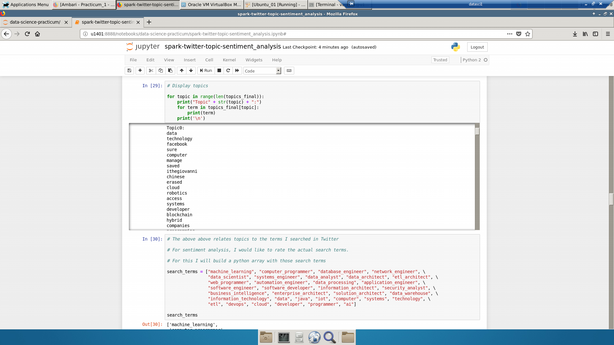

###### Topic Sentiment List
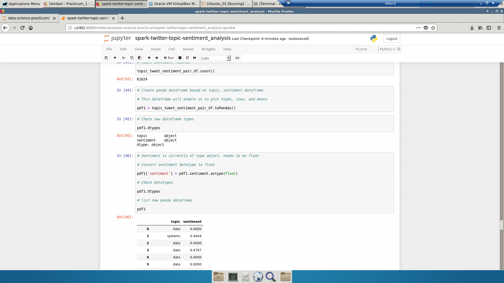

###### Search List
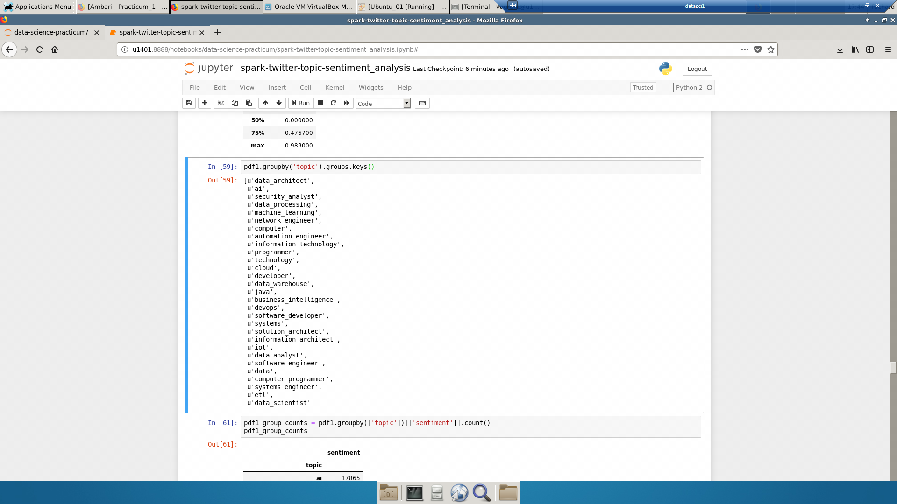

###### Search Term Counts
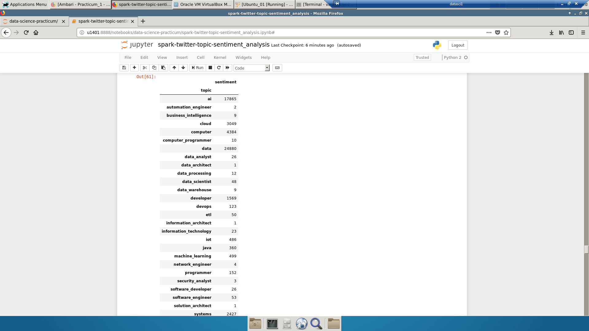

###### Search List Count Bar Chart
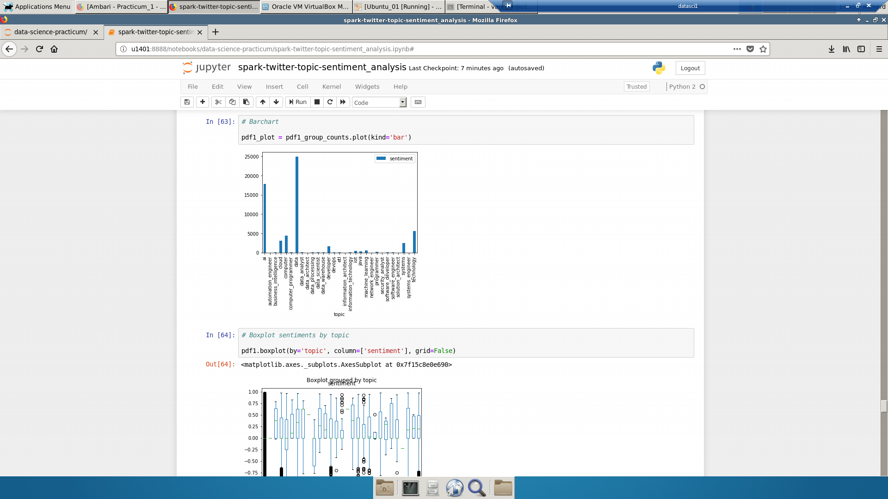

###### Topic Sentiment list

###### Topic Sentiment Average
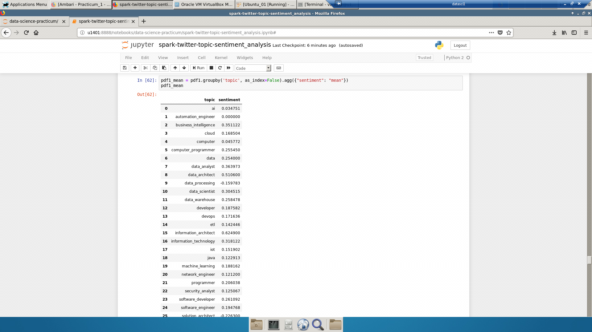

###### Topic Sentiment Average Box Plot 1
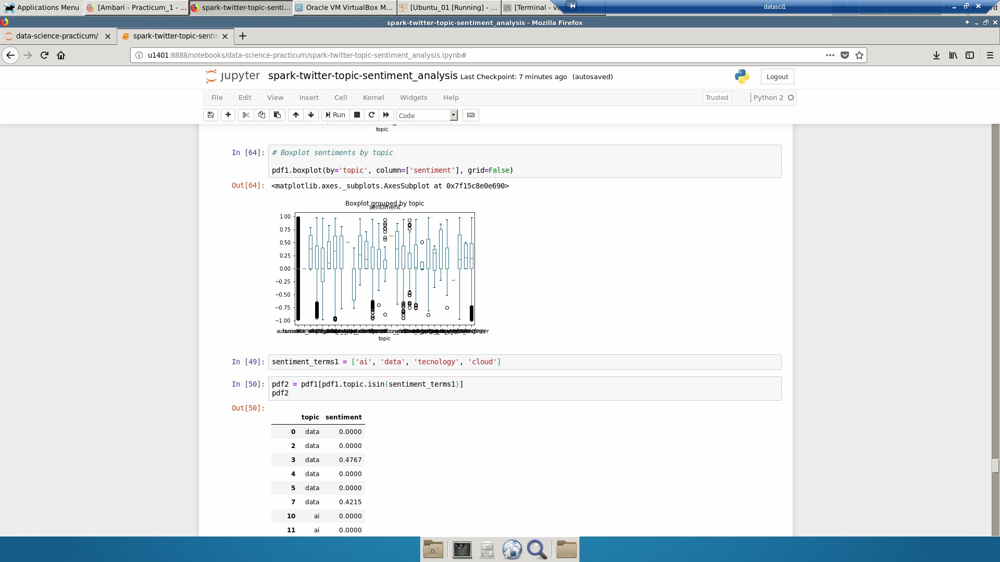

###### Topic Sentiment Average Box Plot 2
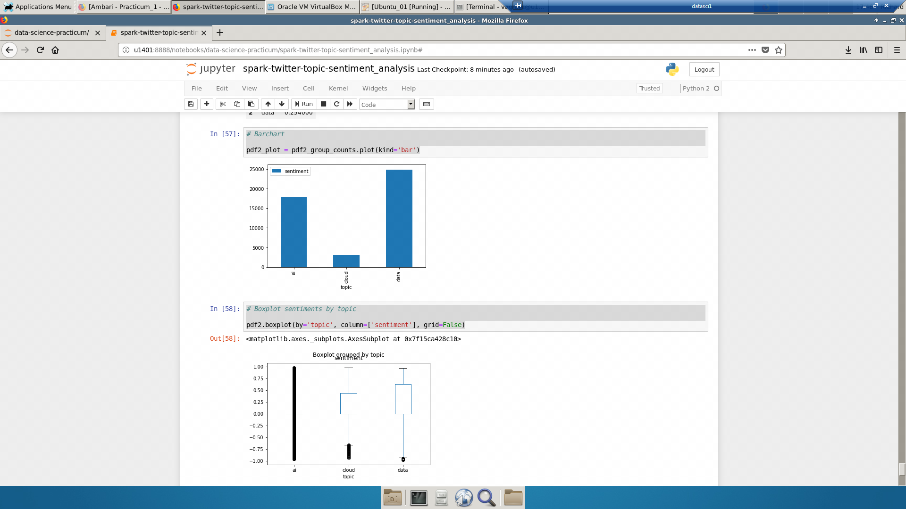

#### Conclusion
Understanding data volumes, tool  choice, and how both affect analysis performance and capability is very important. With the types of data volumes that I initially set out to process I would have been better served running a very small sample locally and then provisioning a cluster in the cloud to run the complete dataset. Having said that, I found that running a subset of the data did provide results.

For the period that I collected tweets, the predominant topics around Information Technology were Facebook and China. Additionally, I found sentiment to be mostly positive.

#### Link to Video Short Version
https://youtu.be/eq4hwWhzKh0

#### Link to Video Long Version
https://youtu.be/R_CSr2CvFl8

#### References:
Databricks. Topic Modeling with Latent Dirichlet Allocation. In Databricks. Retrieved 18:00, June 27, 2018, from https://databricks-prod-cloudfront.cloud.databricks.com/public/4027ec902e239c93eaaa8714f173bcfc/3741049972324885/3783546674231782/4413065072037724/latest.html

Bergvca. (2016) Example on how to do LDA in Spark ML and MLLib with python. In GitHubGist. Retrieved 18:00, June 27, 2018, from https://gist.github.com/Bergvca/a59b127afe46c1c1c479

Soumya Ghosh. (2018, March 17). Topic Modeling with Latent Dirichlet Allocation (LDA) in Pyspark. In Medium. Retrieved 18:00, June 27, 2018, from https://medium.com/@connectwithghosh/topic-modelling-with-latent-dirichlet-allocation-lda-in-pyspark-2cb3ebd5678e

Hacertilbec. (2016, May 7). LDA-spark-python. In GitHub. Retrieved 18:00, June 27, 2018, from https://github.com/hacertilbec/LDA-spark-python/blob/master/SparkLDA.py

Shane Lynn. Summarising, Aggregating, and Grouping data in Python Pandas. In Blog. Retrieved 18:00, June 27, 2018, fromhttps://www.shanelynn.ie/summarising-aggregation-and-grouping-data-in-python-pandas/

Python, R, and Linux Tips. (2018, March 14). How to Make Boxplots in Python with Pandas and Seaborn. In Python, R, and Linux Tips. Retrieved 18:00, June 27, 2018, from http://cmdlinetips.com/2018/03/how-to-make-boxplots-in-python-with-pandas-and-seaborn/

Chris Moffitt. (2014, October 26). Simple Graphing with IPython and Pandas. In Practical Business Python. Retrieved 18:00, June 27, 2018, from http://pbpython.com/simple-graphing-pandas.html

ideoforms. (2015, April 25). python-twitter-examples. In GitHub. Retrieved 18:00, June 27, 2018, from https://github.com/ideoforms/python-twitter-examples/blob/master/twitter-stream-search.py
